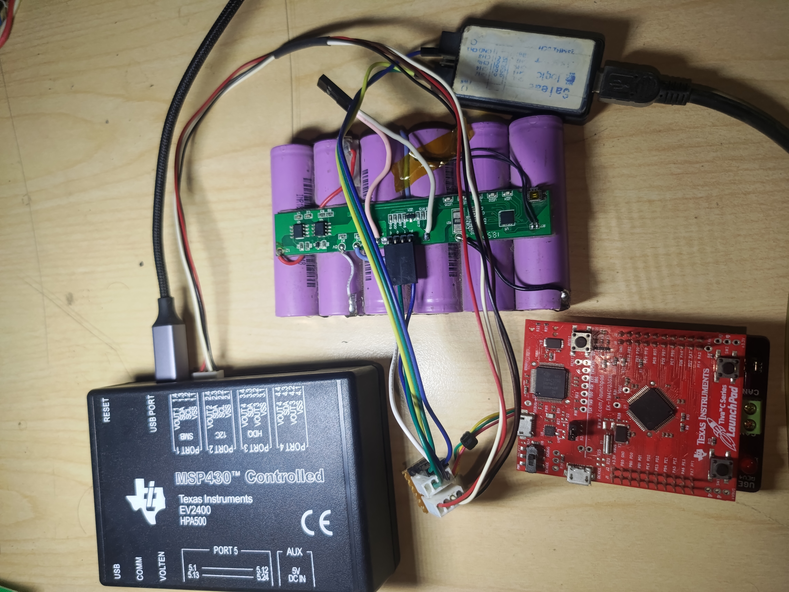

### Omar Mekkawy

  

 

Hi, I am Omar Mekkawy. I am an enthusiastic computer engineer with great knowledge in embedded systems, C programming, BMS (battery management systems), communication protocols, hardware reverse engineering, communication protocols reverse engineering, PCB design, and laboratory equipment.

My repository is specialized in these topics:
- Embedded Systems
- Electronics
- Hardware Reverse Engineering
- Communication Protocol Reverse Engineering
- Battery Management Systems (BMSs)
- Repair
- Modifying Products
- Internet Of Things (IOT)
- Printed Circuit Board (PCB) Design

### Follow Me ✔
You can follow my on :
- My [Facebook Page](https://www.facebook.com/OmarMekkawyOfficial)
- [Twitter](https://twitter.com/Omar_Mekkawy/)
- [LinkedIn](https://www.linkedin.com/in/omar-mekkawy/)
- My [Youtube Channel](https://www.youtube.com/OmarMekkawy)
 
## My Website
- [Omar Mekkawy's Blog](https://omar-mekkawy.com/) (Arabic Language)
- [Omar Mekkawy's Wiki](https://en.omar-mekkawy.com/) (English Language)

### Support Me
It will be a pleasure if you support me on any of the following platforms, it will help (growing my projcts and supporting my [website](https://omar-mekkawy.net/)):
- [Buy Me A Cofee](https://www.buymeacoffee.com/omarmekkawy)
- You can visit my [Patreon](https://www.patreon.com/OmarMekkawy) page and become a Patreon.
- You can do a one-time donation via PayPal at [Donate Using Paypal](https://www.paypal.me/OmarKhaledMekkawy)

Thanks!
